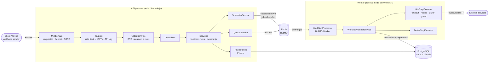
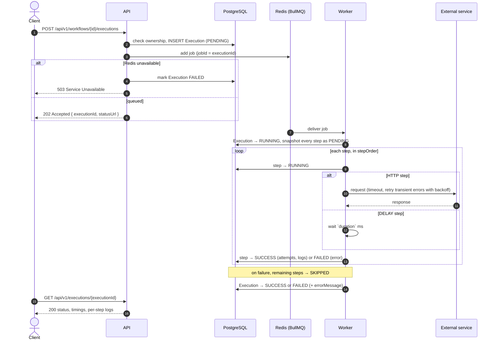
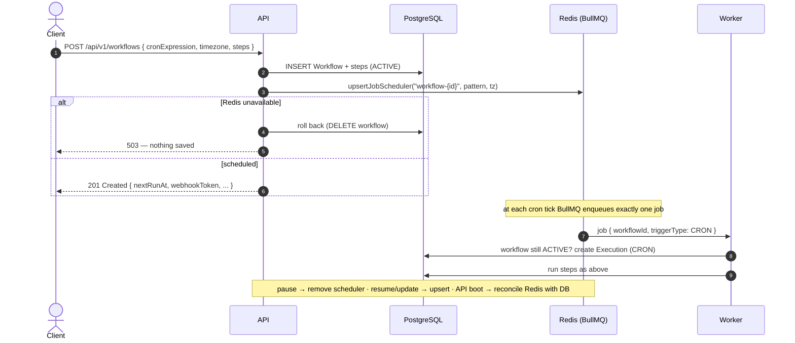
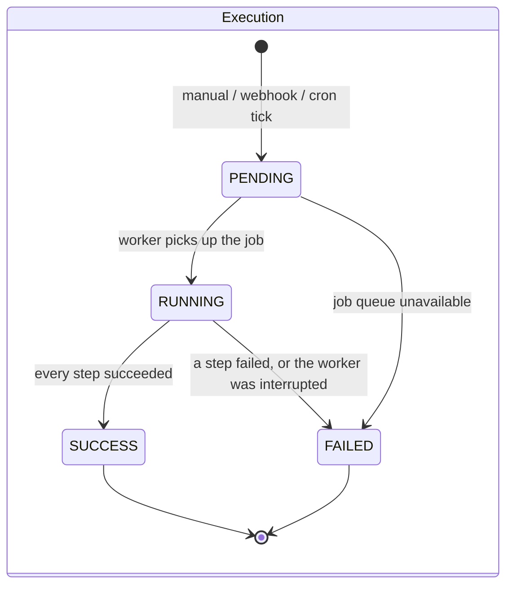
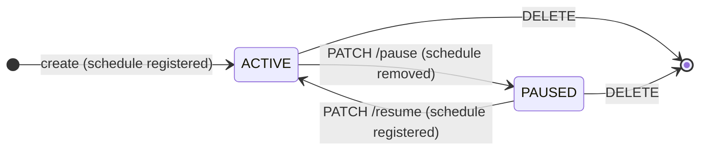
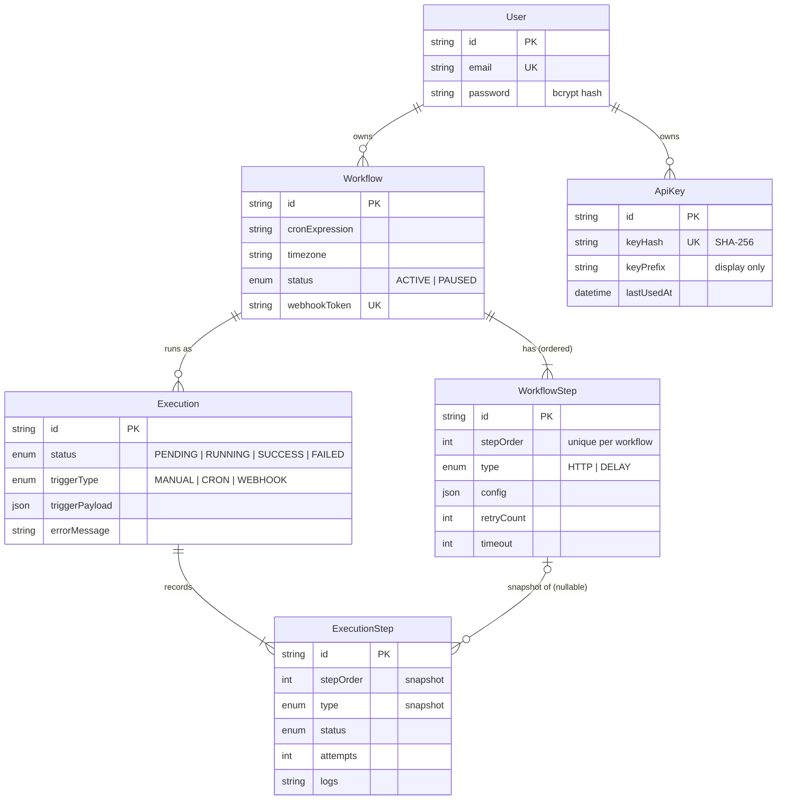

# CronFlow

[](https://github.com/Ramraghul/Cron-Flow/actions/workflows/ci.yml)


**CronFlow is a workflow-automation REST API.** You define a workflow as an ordered list of steps (HTTP requests and delays). CronFlow then runs it **on a cron schedule**, **when a webhook is called**, or **on demand**, and records a full, per-step execution history.

It is built as a production-style backend: validated configuration, layered architecture, a durable job queue with a separate worker process, structured logging, OpenAPI documentation, unit and end-to-end tests, Docker images, CI, and a one-click cloud deployment.

**Live:** [API docs](https://cron-flow-ramraghuls-projects.vercel.app/docs) · [dashboard](https://cron-flow-ui.vercel.app). The hosted API is a demo: on Vercel, scheduled and on-demand runs don't execute (see [Vercel (demo deployment)](#vercel-demo-deployment)).

---

## Contents

- [Features](#features)
- [Tech stack](#tech-stack)
- [Architecture](#architecture)
  - [Components](#components)
  - [Request lifecycle](#request-lifecycle)
  - [Workflow: running a workflow on demand](#workflow-running-a-workflow-on-demand)
  - [Workflow: scheduled (cron) runs](#workflow-scheduled-cron-runs)
  - [State machines](#state-machines)
  - [Data model](#data-model)
- [Getting started](#getting-started)
  - [Option A — everything in Docker](#option-a--everything-in-docker-quickest)
  - [Option B — run the API on your machine](#option-b--run-the-api-on-your-machine-for-development)
  - [Environment variables](#environment-variables)
- [Running tests](#running-tests)
- [Using the API](#using-the-api)
  - [Walkthrough with curl](#walkthrough-with-curl)
  - [Endpoint reference](#endpoint-reference)
  - [Status codes and errors](#status-codes-and-errors)
- [API documentation (Swagger)](#api-documentation-swagger)
- [Deployment](#deployment)
  - [Vercel (demo deployment)](#vercel-demo-deployment)
  - [Render (one-click Blueprint)](#render-one-click-blueprint)
  - [Any container platform](#any-container-platform)
  - [Production checklist](#production-checklist)
- [Design decisions](#design-decisions)
- [Project structure](#project-structure)
- [Upgrading from v2](#upgrading-from-v2)
- [Troubleshooting](#troubleshooting)
- [Roadmap](#roadmap)

---

## Features

| Area | What you get |
| --- | --- |
| **Workflows** | Create, list (pagination, filtering, search, sorting), update, pause/resume and delete workflows. Cron expressions and IANA timezones are validated. |
| **Steps** | `HTTP` steps (method, headers, JSON body) with per-step timeout and retries using exponential backoff. `DELAY` steps pause between calls. |
| **Triggers** | Cron schedules stored in Redis (they never fire twice, even with several API replicas), webhook URLs with an unguessable token, and on-demand runs (`202 Accepted`). |
| **Execution history** | Every run records its status, trigger, timings, webhook payload, and per-step attempts, logs and errors. History survives later edits to the workflow. |
| **Auth** | JWT bearer tokens for users, plus hashed API keys (`x-api-key`) for scripts and CI. Each user can only see their own data. |
| **Security** | Helmet headers, per-IP rate limiting (stricter on login/register), bcrypt passwords, SSRF protection for outbound HTTP steps, secrets redacted from logs. |
| **Operations** | Liveness/readiness probes, structured JSON logs with request IDs, graceful shutdown that drains running jobs, config that fails fast at boot, and an API process and worker process that scale independently. |
| **Docs & tooling** | Swagger UI with examples, a committed `openapi.json`, unit and e2e tests, Docker Compose, GitHub Actions CI, a Render Blueprint, and a standalone HTML dashboard. |

---

## Tech stack

| Layer | Choice | Why |
| --- | --- | --- |
| Runtime | **Node.js 22**, **TypeScript 5** (strict) | Current LTS runtime; strict types catch whole classes of bugs at compile time. |
| Framework | **NestJS 11** (Express) | Modules and dependency injection give clear boundaries. Guards, pipes and filters keep cross-cutting concerns out of business logic. |
| Database | **PostgreSQL 16** + **Prisma 6** | Relational integrity (cascades, unique constraints) with type-safe queries and versioned SQL migrations. |
| Queue & scheduler | **BullMQ 5** on **Redis 7** | Durable jobs survive restarts. Job schedulers give distributed cron without duplicate runs. |
| Validation | class-validator / class-transformer | Declarative DTO rules shared by runtime validation and the OpenAPI schema. |
| API docs | @nestjs/swagger (OpenAPI 3) | Documentation generated from the same code that serves requests, so it cannot drift. |
| Logging | pino via nestjs-pino | Fast structured JSON logs, request correlation IDs, pretty output in development. |
| Testing | Jest, Supertest | Unit tests with mocked infrastructure, plus end-to-end tests against real PostgreSQL and Redis. |
| Delivery | Docker (multi-stage), Docker Compose, GitHub Actions, Render | Reproducible builds; one command for local dev; infrastructure-as-code deploy. |

---

## Architecture

### Components

One Docker image runs in two roles. The **API** handles HTTP. The **worker** consumes queued jobs and runs workflow steps. Locally, and on small deployments, the worker can run inside the API process (`WORKER_ENABLED=true`).



| Module (`src/`) | Responsibility |
| --- | --- |
| `workflows/` | Workflow CRUD, pause/resume, step validation, and keeping schedules in sync. |
| `executions/` | On-demand runs (`202`), execution history, per-step details. |
| `execution-engine/` | BullMQ worker, step runner, HTTP/DELAY executors. Has no HTTP dependencies, so the worker loads only this. |
| `scheduler/` | Redis-backed cron schedules; reconciles Redis with PostgreSQL on boot. |
| `webhooks/` | Token-authenticated trigger endpoint. |
| `auth/`, `api-keys/` | Registration, login, JWT strategy, API keys, and the `JwtOrApiKeyGuard`. |
| `metrics/`, `health/` | Per-user statistics; liveness and readiness probes. |
| `core/`, `config/`, `database/`, `queues/` | Validated config, logging, Prisma client, queue producer. |
| `common/` | Error filter, validators, pagination, and shared utilities (retry, timeout, SSRF, cron). |

### Request lifecycle

Every HTTP request passes through the same pipeline, and every failure leaves it in the same JSON envelope:

```text
  HTTP request
      │
      ▼
┌──────────────────────────────┐
│ pino-http                    │  assigns / propagates X-Request-Id, writes the access log
│ helmet · CORS                │  security headers, allowed origins
├──────────────────────────────┤
│ ThrottlerGuard               │  per-IP rate limit ──────────────────────────► 429
├──────────────────────────────┤
│ JwtOrApiKeyGuard             │  x-api-key → SHA-256 lookup, or Bearer JWT ──► 401
├──────────────────────────────┤
│ ValidationPipe               │  transform to DTO, run every rule ──────────► 400 (all messages)
├──────────────────────────────┤
│ Controller                   │  HTTP ⇄ service call, status code
├──────────────────────────────┤
│ Service                      │  ownership + business rules ────────────────► 404 / 409
├──────────────────────────────┤
│ Repository (Prisma)          │  PostgreSQL
│ QueueService / Scheduler     │  Redis, 5 s timeout ───────────────────────► 503
└──────────────────────────────┘
      │
      ▼
  AllExceptionsFilter → { statusCode, error, message, path, method, timestamp, requestId }
```

### Workflow: running a workflow on demand

The API returns immediately and the worker does the work. The client polls the `statusUrl` from the `202` response.



Webhook runs follow the same path. `POST /api/v1/webhooks/{token}/trigger` stores the JSON body as the execution's `triggerPayload`.

### Workflow: scheduled (cron) runs

Schedules live in Redis, not in API memory, so any number of API replicas can run safely and a restart loses nothing.



### State machines





Steps inside an execution move `PENDING → RUNNING → SUCCESS | FAILED`. Steps after a failure are marked `SKIPPED`.

### Data model



Deleting a user or workflow cascades to everything beneath it. Replacing a workflow's steps sets `ExecutionStep.workflowStepId` to `NULL`, so past runs keep their history.

---

## Getting started

### Prerequisites

| Tool | Version | Needed for |
| --- | --- | --- |
| [Docker](https://docs.docker.com/get-docker/) with Compose v2 | recent | Options A and B (runs PostgreSQL and Redis) |
| [Node.js](https://nodejs.org/) | 22 (≥ 20 works) | Option B and running tests |
| npm | 10+ | Option B |

You can use a locally installed PostgreSQL 14+ and Redis 6.2+ instead of Docker. Point `DATABASE_URL` and `REDIS_URL` at them.

### Option A — everything in Docker (quickest)

```bash
git clone https://github.com/Ramraghul/Cron-Flow.git
cd Cron-Flow
docker compose up --build
```

This starts PostgreSQL, Redis, the API (which applies migrations on start) and a separate worker.

| URL | What |
| --- | --- |
| http://localhost:3000/docs | Swagger UI |
| http://localhost:3000/health/ready | Readiness (PostgreSQL + Redis) |
| http://localhost:3000/api/v1 | API base URL |

Stop with `Ctrl+C`. Run `docker compose down -v` to also delete the data volumes.

### Option B — run the API on your machine (for development)

```bash
# 1. Install dependencies (also generates the Prisma client)
npm ci

# 2. Create your environment file, then set JWT_SECRET (e.g. output of: openssl rand -hex 32)
cp .env.example .env

# 3. Start only the data stores
docker compose up -d postgres redis

# 4. Apply database migrations
npm run prisma:deploy

# 5. (Optional) Seed a demo account: demo@cronflow.dev / demo-password-123
npm run db:seed

# 6. Start in watch mode — the worker runs inside the API process
npm run start:dev
```

To run the worker as its own process, as in production, set `WORKER_ENABLED=false` in `.env` and run `npm run start:worker:dev` in a second terminal.

**Dashboard:** open `dashboard.html` directly in a browser (no build step), then log in or register to see workflows, executions, schedules, metrics and webhook URLs. Its **API** selector switches between **Local** (`http://localhost:3000`) and **Deployed** (`https://cron-flow-ramraghuls-projects.vercel.app`), or takes a custom URL, and each server keeps its own login. Opened from this machine it starts on Local; hosted (like [cron-flow-ui.vercel.app](https://cron-flow-ui.vercel.app)) it starts on Deployed. A `?api=https://…` parameter in the page address overrides both. The servers are listed in `API_TARGETS` at the top of its script.

For a hosted dashboard, the API must be served over **HTTPS** (browsers block `http://` APIs from `https://` pages, except `localhost`), and the API's `CORS_ORIGINS` must include the dashboard's origin.

### Environment variables

All variables are validated at startup (`src/config/env.validation.ts`). If anything is missing or malformed, the app lists every problem and exits. `.env.example` documents each one.

| Variable | Default | Description |
| --- | --- | --- |
| `NODE_ENV` | `development` | `development` \| `test` \| `production`. Pretty logs only in development. |
| `PORT` | `3000` | HTTP port. |
| `DATABASE_URL` | — **required** | PostgreSQL connection string. |
| `REDIS_URL` | — **required** | `redis://` or `rediss://` URL. |
| `JWT_SECRET` | — **required** | Token signing secret. Must be ≥ 32 characters when `NODE_ENV=production`. |
| `JWT_EXPIRES_IN` | `1d` | Access-token lifetime: `900s`, `15m`, `12h`, `7d`… |
| `BCRYPT_SALT_ROUNDS` | `12` | Password hashing cost (4–15). |
| `CORS_ORIGINS` | `*` | Comma-separated allowed origins, or `*`. |
| `TRUST_PROXY_HOPS` | `0` | Reverse-proxy hops to trust for client IPs (set `1` behind Render, Heroku or a load balancer). |
| `SWAGGER_ENABLED` | `true` | Serve `/docs` and `/docs-json`. |
| `THROTTLE_TTL` / `THROTTLE_LIMIT` | `60000` / `100` | Rate-limit window (ms) and requests per window, per client IP. |
| `LOG_LEVEL` | `info` | `trace` \| `debug` \| `info` \| `warn` \| `error` \| `fatal` \| `silent`. |
| `WORKER_ENABLED` | `true` | Run the job worker inside the API process. `dist/worker.js` always enables it. |
| `WORKER_CONCURRENCY` | `5` | Executions processed in parallel per worker process. |
| `SCHEDULER_SYNC_ON_BOOT` | `true` | Reconcile Redis schedules with ACTIVE workflows when the API starts. |
| `HTTP_STEP_ALLOW_PRIVATE_NETWORKS` | `false` | Allow HTTP steps to reach loopback/private/link-local addresses. Keep `false` in production. |
| `RUN_MIGRATIONS` | `false` | *Container only.* Run `prisma migrate deploy` before starting. |
| `DIRECT_DATABASE_URL` | — | *Container only, optional.* Direct (non-pooled) PostgreSQL URL used for migrations when `DATABASE_URL` goes through a connection pooler, such as Neon's. |
| `E2E_DATABASE_URL` / `E2E_REDIS_URL` | see `test/e2e/env.ts` | *Tests only.* Where the e2e suite connects. |

---

## Running tests

| Command | What it runs | Needs |
| --- | --- | --- |
| `npm test` | Unit tests (`src/**/*.spec.ts`) | nothing |
| `npm run test:cov` | Unit tests + coverage report in `coverage/` | nothing |
| `npm run test:watch` | Unit tests in watch mode | nothing |
| `npm run test:e2e` | End-to-end suite (`test/app.e2e-spec.ts`) | `docker compose up -d postgres redis` |
| `npm run typecheck` | `tsc --noEmit` over source **and** tests | nothing |
| `npm run lint` | ESLint (type-aware rules) | nothing |

The suite has three layers:

1. **Unit tests** sit next to the code they test. Infrastructure (Prisma, Redis, `fetch`, timers) is mocked, and the tests cover success paths, error paths, edge cases and validation. Examples: `workflows.service.spec.ts` (rollback when the scheduler is down, pause/resume conflicts), `http-step.executor.spec.ts` (retries, timeouts, SSRF blocking, redirects), `workflow-runner.service.spec.ts` (step ordering, skip-after-failure, interrupted runs).
2. **HTTP contract tests** (`workflows.controller.spec.ts`) exercise the real routes, the production `ValidationPipe` and the error filter over HTTP with Supertest. They pin down status codes and response shapes.
3. **End-to-end tests** boot the real `AppModule` against PostgreSQL and Redis with the in-process worker and a local HTTP target server. They verify the whole flow: create → schedule in Redis → run → HTTP call made → history recorded → retries → pause/resume → cascade delete.

Jest transpiles tests without type-checking, for speed. `npm run typecheck` covers types, and CI runs both.

---

## Using the API

| Server | Base URL |
| --- | --- |
| Local | `http://localhost:3000/api/v1` |
| Deployed | `https://cron-flow-ramraghuls-projects.vercel.app/api/v1` |

Send request bodies as JSON.

### Walkthrough with curl

The examples use [`jq`](https://jqlang.github.io/jq/) to pull values out of responses.

**1. Register (or log in) and keep the token**

```bash
API=http://localhost:3000/api/v1                                  # local
# API=https://cron-flow-ramraghuls-projects.vercel.app/api/v1     # deployed

TOKEN=$(curl -s -X POST "$API/auth/register" \
  -H 'Content-Type: application/json' \
  -d '{"email":"ada@example.com","password":"correct-horse-battery-staple"}' | jq -r .accessToken)
```

```json
{
  "accessToken": "eyJhbGciOiJIUzI1NiIsInR5cCI6IkpXVCJ9...",
  "tokenType": "Bearer",
  "expiresIn": 86400,
  "user": { "id": "cm0x8b1f40000abcdlkj2h3g4", "email": "ada@example.com" }
}
```

**2. Create a workflow** — GET a URL, wait two seconds, then POST a report, every night at 02:00 London time:

```bash
WORKFLOW_ID=$(curl -s -X POST "$API/workflows" \
  -H "Authorization: Bearer $TOKEN" -H 'Content-Type: application/json' \
  -d '{
    "name": "Nightly data sync",
    "cronExpression": "0 2 * * *",
    "timezone": "Europe/London",
    "steps": [
      { "stepOrder": 1, "type": "HTTP",  "config": { "url": "https://httpbin.org/get" } },
      { "stepOrder": 2, "type": "DELAY", "config": { "duration": 2000 } },
      { "stepOrder": 3, "type": "HTTP",
        "config": { "url": "https://httpbin.org/post", "method": "POST", "body": { "report": "daily" } },
        "retryCount": 5, "timeout": 10000 }
    ]
  }' | jq -r .id)
```

```json
{
  "id": "cm0x8b1f40001abcdlkj2h3g4",
  "name": "Nightly data sync",
  "description": null,
  "cronExpression": "0 2 * * *",
  "timezone": "Europe/London",
  "status": "ACTIVE",
  "nextRunAt": "2026-09-15T01:00:00.000Z",
  "createdAt": "2026-09-14T10:00:00.000Z",
  "updatedAt": "2026-09-14T10:00:00.000Z",
  "webhookToken": "k3Jd9sQ2mVx7LpA0bR4tYw8eZc1uN6hG",
  "steps": [
    { "id": "cm0x…", "stepOrder": 1, "type": "HTTP", "config": { "url": "https://httpbin.org/get", "method": "GET" }, "retryCount": 3, "timeout": 30000 },
    "…"
  ]
}
```

**3. Run it now and follow the execution**

```bash
EXECUTION_ID=$(curl -s -X POST "$API/workflows/$WORKFLOW_ID/executions" \
  -H "Authorization: Bearer $TOKEN" | jq -r .executionId)

curl -s "$API/executions/$EXECUTION_ID" -H "Authorization: Bearer $TOKEN" | jq
```

```json
{
  "id": "cm0xb2c3d0002abcd4e5f6g7h",
  "workflowId": "cm0x8b1f40001abcdlkj2h3g4",
  "status": "SUCCESS",
  "triggerType": "MANUAL",
  "errorMessage": null,
  "startedAt": "2026-09-14T10:00:00.120Z",
  "completedAt": "2026-09-14T10:00:03.410Z",
  "durationMs": 3290,
  "createdAt": "2026-09-14T10:00:00.090Z",
  "workflowName": "Nightly data sync",
  "triggerPayload": null,
  "steps": [
    { "stepOrder": 1, "type": "HTTP",  "status": "SUCCESS", "attempts": 1, "logs": "GET https://httpbin.org/get → 200 after 1 attempt(s)", "durationMs": 640, "…": "…" },
    { "stepOrder": 2, "type": "DELAY", "status": "SUCCESS", "attempts": 1, "logs": "Waited 2000ms", "durationMs": 2003, "…": "…" },
    { "stepOrder": 3, "type": "HTTP",  "status": "SUCCESS", "attempts": 1, "logs": "POST https://httpbin.org/post → 200 after 1 attempt(s)", "durationMs": 610, "…": "…" }
  ]
}
```

**4. List, filter and paginate**

```bash
curl -s "$API/workflows?status=ACTIVE&search=sync&sortBy=name&sortOrder=asc&page=1&limit=20" \
  -H "Authorization: Bearer $TOKEN" | jq '.meta'
curl -s "$API/workflows/$WORKFLOW_ID/executions?status=FAILED&triggerType=CRON" \
  -H "Authorization: Bearer $TOKEN" | jq
```

```json
{ "page": 1, "limit": 20, "totalItems": 1, "totalPages": 1, "hasNextPage": false, "hasPreviousPage": false }
```

**5. Trigger from another system with a webhook** (no auth header; the token is the credential)

```bash
WEBHOOK_TOKEN=$(curl -s "$API/workflows/$WORKFLOW_ID" -H "Authorization: Bearer $TOKEN" | jq -r .webhookToken)
curl -s -X POST "$API/webhooks/$WEBHOOK_TOKEN/trigger" \
  -H 'Content-Type: application/json' -d '{"event":"deploy.finished","ref":"main"}'
```

**6. Update, pause, resume, delete**

```bash
curl -s -X PATCH "$API/workflows/$WORKFLOW_ID" -H "Authorization: Bearer $TOKEN" \
  -H 'Content-Type: application/json' -d '{"cronExpression":"*/30 * * * *"}'
curl -s -X PATCH "$API/workflows/$WORKFLOW_ID/pause"  -H "Authorization: Bearer $TOKEN"
curl -s -X PATCH "$API/workflows/$WORKFLOW_ID/resume" -H "Authorization: Bearer $TOKEN"
curl -s -X DELETE "$API/workflows/$WORKFLOW_ID" -H "Authorization: Bearer $TOKEN" -o /dev/null -w '%{http_code}\n'   # 204
```

**7. Use an API key instead of a JWT** (for CI or scripts)

```bash
API_KEY=$(curl -s -X POST "$API/api-keys" -H "Authorization: Bearer $TOKEN" \
  -H 'Content-Type: application/json' -d '{"name":"CI pipeline"}' | jq -r .key)   # shown only once
curl -s "$API/workflows" -H "x-api-key: $API_KEY" | jq '.meta.totalItems'
```

### Endpoint reference

Auth: 🔓 public · 🔑 JWT **or** API key · 🎫 JWT only · 🪝 webhook token in URL

| Method | Path | Auth | Success | Description |
| --- | --- | :---: | :---: | --- |
| `GET` | `/api/v1/` | 🔓 | 200 | Service info: version, dependency health and links to the docs and probes |
| `POST` | `/api/v1/auth/register` | 🔓 | 201 | Create an account; returns an access token |
| `POST` | `/api/v1/auth/login` | 🔓 | 200 | Exchange credentials for an access token |
| `GET` | `/api/v1/auth/me` | 🔑 | 200 | Current identity and auth method |
| `POST` | `/api/v1/workflows` | 🔑 | 201 | Create a workflow and register its schedule |
| `GET` | `/api/v1/workflows` | 🔑 | 200 | List (`page`, `limit`, `status`, `search`, `sortBy`, `sortOrder`) |
| `GET` | `/api/v1/workflows/{id}` | 🔑 | 200 | Workflow with steps and webhook token |
| `PATCH` | `/api/v1/workflows/{id}` | 🔑 | 200 | Partial update; `steps` replaces the list |
| `PATCH` | `/api/v1/workflows/{id}/pause` | 🔑 | 200 | Stop scheduled and webhook runs |
| `PATCH` | `/api/v1/workflows/{id}/resume` | 🔑 | 200 | Re-register the schedule |
| `DELETE` | `/api/v1/workflows/{id}` | 🔑 | 204 | Delete with history and schedule |
| `POST` | `/api/v1/workflows/{workflowId}/executions` | 🔑 | 202 | Run now (asynchronous) |
| `GET` | `/api/v1/workflows/{workflowId}/executions` | 🔑 | 200 | Run history (`page`, `limit`, `status`, `triggerType`) |
| `GET` | `/api/v1/executions/{id}` | 🔑 | 200 | Execution with per-step logs |
| `POST` | `/api/v1/webhooks/{token}/trigger` | 🪝 | 202 | Run from an external system; body stored as payload |
| `GET` | `/api/v1/scheduler/jobs` | 🔑 | 200 | Live schedule state and next run times |
| `GET` | `/api/v1/metrics` | 🔑 | 200 | Counts, success rate, average duration, recent runs |
| `GET` | `/api/v1/metrics/workflows/{workflowId}` | 🔑 | 200 | Metrics for one workflow |
| `POST` | `/api/v1/api-keys` | 🎫 | 201 | Create an API key (full key returned once) |
| `GET` | `/api/v1/api-keys` | 🎫 | 200 | List keys (masked) |
| `DELETE` | `/api/v1/api-keys/{id}` | 🎫 | 204 | Revoke a key |
| `GET` | `/health/live` | 🔓 | 200 | Liveness probe (process up) |
| `GET` | `/health/ready` | 🔓 | 200 / 503 | Readiness probe (PostgreSQL + Redis) |

**Step configuration**

| Type | `config` | Step options |
| --- | --- | --- |
| `HTTP` | `url` (required, absolute http/https), `method` (`GET` default, `POST`, `PUT`, `PATCH`, `DELETE`, `HEAD`), `headers` (string map), `body` (any JSON; sent for POST/PUT/PATCH/DELETE) | `retryCount` 0–10 (default 3), `timeout` 1000–300000 ms (default 30000) |
| `DELAY` | `duration` 1–300000 ms | — |

A workflow has 1–20 steps with unique `stepOrder` values. Cron expressions use the standard **5 fields** (`minute hour day-of-month month day-of-week`), evaluated in `timezone` (IANA, default `UTC`).

### Status codes and errors

| Code | When |
| --- | --- |
| `200 OK` / `201 Created` / `204 No Content` | Read or update / create / delete succeeded |
| `202 Accepted` | Execution queued; poll `statusUrl` |
| `400 Bad Request` | Validation failed (all problems listed), malformed JSON, or an empty update |
| `401 Unauthorized` | Missing, invalid or expired token, or an invalid API key |
| `404 Not Found` | Resource does not exist **or belongs to another user** (so IDs cannot be probed) |
| `409 Conflict` | Duplicate email; pausing a paused or resuming an active workflow; webhook on a paused workflow |
| `429 Too Many Requests` | Rate limit hit (100/min per IP; 10/min for register and login) |
| `503 Service Unavailable` | Redis or PostgreSQL unreachable. Nothing is left half-done: see [design decisions](#design-decisions) |

Every error uses one envelope. `requestId` matches the `X-Request-Id` response header and the server log line:

```json
{
  "statusCode": 400,
  "error": "Bad Request",
  "message": [
    "cronExpression must be a valid 5-field cron expression (minute hour day-of-month month day-of-week)",
    "timezone must be a valid IANA timezone, e.g. Europe/London",
    "steps must not contain duplicate stepOrder values",
    "steps.0.config.url must be an absolute http(s) URL",
    "steps.1.config.duration must not be less than 1"
  ],
  "path": "/api/v1/workflows",
  "method": "POST",
  "timestamp": "2026-09-14T10:00:00.000Z",
  "requestId": "5f0e7c1a-3b8e-4d7a-9c2f-1e6b8a4d2c10"
}
```

---

## API documentation (Swagger)

- **Swagger UI:** `http://localhost:3000/docs` locally, or the [deployed docs](https://cron-flow-ramraghuls-projects.vercel.app/docs). Click **Authorize** and paste a JWT or API key; authorization persists across reloads. Request bodies include ready-to-send examples.
- **OpenAPI JSON:** `/docs-json` on either server.
- **"Try it out" servers:** the **Servers** dropdown offers Local and Deployed; the one you're viewing the docs on is selected by default. Calling the deployed API from local docs requires `http://localhost:3000` in its `CORS_ORIGINS`.
- **Committed spec:** [`docs/openapi.json`](docs/openapi.json), viewable without running anything. Regenerate it after API changes with `npm run openapi:export`, which needs no database, Redis or `.env`.

Every endpoint documents its request schema, parameters, response schema with examples, and each error status it can return. Set `SWAGGER_ENABLED=false` to hide the docs in production.

---

## Deployment

The same image runs everywhere: `node dist/main.js` for the API and `node dist/worker.js` for the worker. Set `RUN_MIGRATIONS=true` to apply pending migrations before start. Prisma takes an advisory lock, so this is safe with several replicas.

### Vercel (demo deployment)

The live demo runs on Vercel at `https://cron-flow-ramraghuls-projects.vercel.app`. Vercel runs the app only while it answers a request, so there is no worker between requests: **on-demand runs, webhook runs and cron schedules stay `PENDING`**. Everything else (auth, workflow management, API keys, metrics, Swagger) works. For executions that actually run, use [Render](#render-one-click-blueprint) or [any container platform](#any-container-platform).

How it is set up:

1. Import the repository in Vercel (NestJS is detected automatically), and add the **Prisma Postgres** and **Redis** integrations from the **Storage** tab.
2. Set these environment variables: `DATABASE_URL` (the plain `postgres://…` string, without quotes), `REDIS_URL`, `JWT_SECRET` (32+ characters), `NODE_ENV=production`, `WORKER_ENABLED=false`, `TRUST_PROXY_HOPS=1` (so rate limits count each client, not the Vercel proxy, and generated links use `https`), and `CORS_ORIGINS=https://cron-flow-ui.vercel.app,http://localhost:3000`. Don't set `PORT`; Vercel assigns it.
3. Vercel doesn't run migrations. Apply them once from your machine: `DATABASE_URL='postgres://…' npx prisma migrate deploy`. Verify afterwards with `GET /api/v1`, which reports version, dependency health and links.
4. **Make it public:** under **Settings → Deployment Protection**, disable **Vercel Authentication**. Otherwise every request is redirected to a Vercel login, and the dashboard can't reach the API.
5. Vercel ships only the files the code visibly references. The app resolves Swagger UI's files (`swagger-ui-dist`) explicitly, so Vercel includes them and `/docs` serves them directly. If they are ever missing, it falls back to the jsDelivr CDN. The startup log shows which: `Swagger UI served at /docs (UI assets from local files)`.

### Render (one-click Blueprint)

[`render.yaml`](render.yaml) deploys CronFlow on **free plans only**:

| Resource | Plan | Role |
| --- | --- | --- |
| `cronflow-api` web service | Render Free | API, with the worker running in the same process (Docker) |
| `cronflow-redis` Key Value | Render Free | Redis for the job queue and cron schedules |
| PostgreSQL | [Neon](https://neon.com) Free (external) | Permanent free database. Render's own free Postgres expires after 30 days |

**1. Create the database on Neon** (free, no card required)

1. Sign up at [neon.com](https://neon.com) and create a project. Choose the region closest to Render's; the Blueprint uses Singapore, so pick **AWS Asia Pacific (Singapore)**.
2. Open **Connect** and copy two connection strings:
   - **Pooled** (connection pooling on). Append `&pgbouncer=true&connect_timeout=15`. This is `DATABASE_URL`.
   - **Direct** (connection pooling off). This is `DIRECT_DATABASE_URL`, used only to apply migrations.

   The app goes through Neon's pooler, as Neon recommends: the pooler handles the database sleeping and waking, and idle app connections don't hold it open.

**2. Deploy on Render**

1. Push this repository to GitHub.
2. In the [Render Dashboard](https://dashboard.render.com), choose **New → Blueprint**, select the repository, and check that both services show the **Free** plan.
3. When prompted, paste `DATABASE_URL` and `DIRECT_DATABASE_URL` from Neon, then click **Apply**. Render generates `JWT_SECRET` for you.
4. The first deploy builds the Docker image and applies the migrations. Then verify:

   ```bash
   curl https://<your-service>.onrender.com/health/ready
   ```

   and open `https://<your-service>.onrender.com/docs`.

**3. Keep it awake (free)**

Free web services sleep after 15 minutes without traffic, and **cron schedules cannot fire while the service is asleep**. Create a free HTTP monitor (for example on [UptimeRobot](https://uptimerobot.com)) that requests `https://<your-service>.onrender.com/health/live` every 5 minutes. `/health/live` doesn't touch the database, so it keeps the API awake without waking Neon.

**4. Connect the dashboard**

Set `PRODUCTION_API_BASE` at the top of the dashboard's script to `https://<your-service>.onrender.com`. `render.yaml` sets `CORS_ORIGINS` to `https://cron-flow-ui.vercel.app`; if your dashboard lives elsewhere, change it under **Render → cronflow-api → Environment**.

> **Staying within the free limits**
> - Render includes 750 free instance hours per workspace each month: enough for one service running all month, but shared with any other free services in the same workspace.
> - Neon's free plan includes 100 compute-hours a month and suspends after 5 idle minutes. Keep the combined schedules of all workflows to at most one run every 10–15 minutes; more frequent runs keep the database awake enough to use up the hours, after which it pauses until the next month (it is never billed).
> - Free Key Value keeps data in memory only. On every start the API re-registers all schedules from PostgreSQL, so only a job queued at the exact moment of a restart can be lost.
> - With `autoDeployTrigger: checksPass`, pushes to `main` redeploy only after CI passes.

### Any container platform

The same steps work on AWS ECS/Fargate, Google Cloud Run (with an always-on worker), Fly.io, Railway or Kubernetes:

1. **Build and push** the image: `docker build -t <registry>/cronflow:<tag> . && docker push <registry>/cronflow:<tag>`.
2. **Provision** PostgreSQL 14+ and Redis 6.2+. Configure Redis with `maxmemory-policy noeviction` (BullMQ requires it) and enable persistence.
3. **Run two services** from the image:
   - **API:** default command, port `3000`, `WORKER_ENABLED=false`, one or more replicas.
   - **Worker:** command `node dist/worker.js`, no port, scaled by queue load.
4. **Migrations:** set `RUN_MIGRATIONS=true` on the API, or run `npx prisma migrate deploy` as a pre-deploy/one-off task. If `DATABASE_URL` goes through a connection pooler, also set `DIRECT_DATABASE_URL` to a direct connection.
5. **Probes:** liveness `GET /health/live`, readiness `GET /health/ready`.
6. **Shutdown:** allow ≥ 30 s for termination so the worker can finish in-flight executions. The image uses `tini`, so `SIGTERM` reaches the app.
7. **Behind a load balancer:** set `TRUST_PROXY_HOPS=1` so rate limiting uses real client IPs.

### Production checklist

- [ ] `JWT_SECRET` is a random value of ≥ 32 characters, stored in the platform's secret manager.
- [ ] `CORS_ORIGINS` lists only your front-end origins.
- [ ] `HTTP_STEP_ALLOW_PRIVATE_NETWORKS=false` (the default).
- [ ] `TRUST_PROXY_HOPS` matches your proxy setup.
- [ ] Redis uses `noeviction` and persistence (AOF or RDB).
- [ ] PostgreSQL backups are enabled.
- [ ] The worker runs as its own service with a ≥ 30 s stop grace period.
- [ ] Logs (JSON on stdout) are shipped to your log platform, and alerts watch `/health/ready`.
- [ ] You have decided whether to disable Swagger (`SWAGGER_ENABLED=false`).

---

## Design decisions

**Distributed cron via BullMQ job schedulers.** In-process cron timers fire once *per replica* and disappear on restart. Storing schedules in Redis means each tick produces exactly one job no matter how many API instances run. PostgreSQL stays the source of truth, and the API reconciles Redis against it on boot.

**Write first, then enqueue, and never leave half-done state.** An on-demand run inserts a `PENDING` execution first, so the client gets an ID immediately, then enqueues it with the execution ID as the job ID (idempotent). If Redis is down, the row is marked `FAILED` and the API returns `503`. Creating a workflow rolls back if its schedule cannot be registered, and resuming reverts to `PAUSED`.

**Retries per step; at-most-once side effects.** Transient HTTP failures (network errors, timeouts, 408/425/429/5xx) are retried with exponential backoff inside the step; other 4xx responses are not retried. Jobs themselves run once: retrying a whole job would repeat steps that already POSTed somewhere. If a worker dies mid-run, the re-delivered job marks the execution `FAILED` instead of silently re-running it.

**History is a snapshot.** Execution steps copy `stepOrder` and `type` and reference the workflow step with `ON DELETE SET NULL`. Editing a workflow never rewrites or deletes past runs.

**SSRF protection.** Users choose the URLs the server calls, so the executor resolves each host and refuses loopback, private, link-local (including cloud metadata at `169.254.169.254`) and other non-public ranges, and does not follow redirects. *Limitation:* the check happens before the connection, so a DNS-rebinding attacker could still race it. Pinning the resolved IP is on the roadmap.

**Credentials handled by type.** Passwords are low-entropy, so they use bcrypt, with a dummy comparison for unknown emails to prevent account enumeration by timing. API keys carry 256 bits of randomness, so a fast indexed SHA-256 lookup is safe and avoids bcrypt cost on every request. API keys can call resource endpoints but cannot create more keys.

**404 rather than 403 for other users' resources.** This avoids revealing that an ID exists.

**Validation reports everything at once.** A custom `exceptionFactory` flattens nested errors. Nest's default formatter drops a property's own messages when it also has nested errors, which forces clients through several fix-and-retry rounds.

**Fail fast, fail loudly — but not publicly.** Configuration is validated at boot. Unexpected errors are logged with stack traces and returned as a generic `500`. The public readiness probe reports `up`/`down` without internal hostnames. Logs never include headers, and webhook tokens are redacted from URLs.

**Separable processes.** The execution engine module has no HTTP dependencies, so `dist/worker.js` boots a lean application context. API and workers scale, deploy and fail independently.

---

## Project structure

```text
.
├── src/
│   ├── main.ts                    # API entrypoint
│   ├── worker.ts                  # standalone worker entrypoint
│   ├── app.module.ts / worker.module.ts
│   ├── app.setup.ts               # middleware, prefix, validation, filter (shared with e2e tests)
│   ├── app.constants.ts
│   ├── config/                    # env schema + typed configuration
│   ├── core/                      # config, logging and database wiring
│   ├── database/                  # PrismaService
│   ├── common/                    # error filter, validators, pagination, utils (retry, timeout, SSRF, cron)
│   ├── auth/                      # register/login, JWT strategy, guards
│   ├── api-keys/
│   ├── workflows/                 # controller · service · repository · DTOs · mapper
│   ├── executions/
│   ├── execution-engine/          # worker processor · runner · step executors
│   ├── scheduler/                 # BullMQ job schedulers
│   ├── queues/                    # queue producer
│   ├── webhooks/  metrics/  health/
│   ├── swagger/                   # OpenAPI document builder
│   └── scripts/export-openapi.ts
├── test/
│   ├── app.e2e-spec.ts            # end-to-end suite
│   ├── e2e/                       # e2e app bootstrap, env, global setup, helpers
│   ├── utils/                     # test factories and mocks
│   └── setup-*.ts
├── prisma/
│   ├── schema.prisma
│   ├── migrations/                # versioned SQL migrations
│   └── seed.ts
├── docker/
│   ├── entrypoint.sh              # optional migrations, then exec
│   └── postgres/init/             # creates the e2e test database
├── docs/openapi.json              # generated OpenAPI spec
├── .github/workflows/ci.yml       # lint · typecheck · unit · e2e · docker build
├── Dockerfile                     # multi-stage, non-root, tini, healthcheck
├── docker-compose.yml             # postgres · redis · api · worker
├── render.yaml                    # Render Blueprint
├── dashboard.html                 # standalone dashboard
└── .env.example
```

---

## Upgrading from v2

v3 is a breaking release. Apply the migration with `npm run prisma:deploy`, then update clients:

| Change | v2 | v3 |
| --- | --- | --- |
| URL prefix | `/workflows` | `/api/v1/workflows` (health stays at `/health/*`) |
| Auth response | `{ id, email, token }` | `{ accessToken, tokenType, expiresIn, user }` |
| List responses | bare arrays / `{ executions, total }` | `{ data, meta }` with pagination metadata |
| Run now | `POST /executions/{workflowId}/trigger` → 201 | `POST /workflows/{workflowId}/executions` → **202** |
| Health | `GET /metrics/health` | `GET /health/live`, `GET /health/ready` |
| Deletes | 200 with message | **204 No Content** |
| Metrics | platform-wide | scoped to the caller; `successRatePercent` is a number |
| API keys | bcrypt-hashed and never enforced | SHA-256, enforced on resource routes. **Create new keys** — old keys do not work. |
| Config | `JWT_SECRET` fell back to a hard-coded value; `REDIS_HOST`/`REDIS_PORT` | `JWT_SECRET` required; only `REDIS_URL` |

The `20260914120000_v3_execution_history` migration back-fills existing data safely. It renumbers duplicate `stepOrder` values, snapshots execution steps, and adds cascades and indexes. Existing workflows get `timezone = 'UTC'`. The bundled `dashboard.html` is already updated.

---

## Troubleshooting

| Symptom | Fix |
| --- | --- |
| `Invalid environment configuration` on start | The message lists each bad variable. Compare your `.env` with `.env.example`. |
| `port is already allocated` from Docker | Something else uses 5432, 6379 or 3000. Stop it, or change the host port in `docker-compose.yml` and your URLs. |
| `503` when creating or pausing workflows | Redis is unreachable. Check `GET /health/ready` and `docker compose ps`. |
| Executions stay `PENDING` | No worker is consuming jobs. Set `WORKER_ENABLED=true` or run `npm run start:worker`. |
| HTTP step fails with `non-public address` | The SSRF guard blocked a local/private URL. For local testing only, set `HTTP_STEP_ALLOW_PRIVATE_NETWORKS=true`. |
| `429` on login during testing | Register and login allow 10 requests per minute per IP. Wait a minute. |
| e2e tests cannot connect | Run `docker compose up -d postgres redis`, or set `E2E_DATABASE_URL` / `E2E_REDIS_URL`. |
| The deployed API redirects to a Vercel login page | Vercel's Deployment Protection is on. Disable **Vercel Authentication** under **Settings → Deployment Protection**. |
| Prisma client errors after pulling changes | Run `npm run prisma:generate` (also runs automatically on `npm install`). |

---

## Roadmap

- Webhook signature verification (HMAC) and token rotation
- Refresh tokens and token revocation
- Passing output from one step into the next; more step types (email, Slack)
- Execution retention/cleanup job
- OpenTelemetry tracing and Prometheus metrics
- Pinning resolved IPs for outbound calls to close the DNS-rebinding gap

## License

ISC
